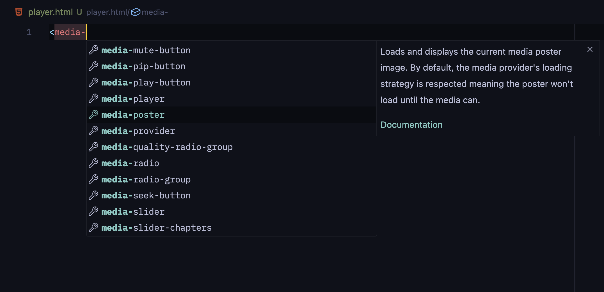

**This step is optional.** VS Code (VSC) provides support for extending the known HTML entities through
[VSC Custom Data](https://github.com/microsoft/vscode-custom-data). Once set up, it enables
autocomplete suggestions for custom player elements and on-hover information such as documentation
and type data.

1. Create the VSC settings file at the root of your project directory:

::code[../vscode/create-settings]{copy=true}

2. Add the custom HTML data file path to `html.customData` inside the newly created settings file:

::code[../vscode/html-data]{title=.vscode/settings.json copy=true}
