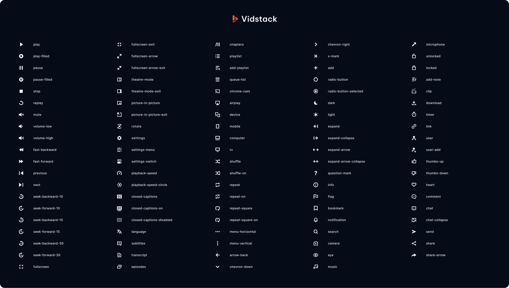

# Vidstack Icons

[![package-badge]][package]
[![discord-badge]][discord]

Vidstack Icons is a beautifully hand-crafted collection of media icons. Our icons are
bold, clean, consistent, and perfectly crafted. It is specifically designed to suit all types of
media player interfaces.



## Catalog

The easiest way to get started is by heading over to our [media catalog][catalog] on our website,
searching for an icon, copying the raw SVG, and finally pasting it in your project.

## Raw Import

The raw SVG files can be imported from this package like so:

```js
// Examples
import PauseIcon from '@vidstack/icons/raw/pause.svg';
import PlayIcon from '@vidstack/icons/raw/play.svg';
```

## Bundle

We recommend using [unplugin-icons](https://github.com/antfu/unplugin-icons) as it has many
bundler (Vite/Rollup/Webpack), framework (React/Vue/Preact/Solid/Svelte) and customization
options.

First, you'll need to configure the plugin like so:

```js
import { FileSystemIconLoader } from 'unplugin-icons/loaders';

Icons({
  customCollections: {
    vidstack: FileSystemIconLoader('./node_modules/@vidstack/icons/raw'),
  },
});
```

Now, you can import the icons like so:

```js
import PauseIcon from '~icons/vidstack/pause';
import PlayIcon from '~icons/vidstack/play';
```

The complete list of icons can be found in our [media catalog][catalog].

## React

```bash
npm i @vidstack/react
```

```jsx
import { PauseIcon, PlayIcon } from '@vidstack/react';

<PlayIcon width="28" height="28" />;
<PauseIcon width="28" height="28" />;
```

The complete list of icons can be found in our [media catalog][catalog].

## Figma

Our media icons are available on Figma! You can get a copy from our [community page][figma].

## 📝 License

Vidstack Icons is [MIT licensed](./LICENSE).

[vidstack]: https://vidstack.io
[catalog]: https://vidstack.io/icons
[package]: https://www.npmjs.com/package/@vidstack/icons
[package-badge]: https://img.shields.io/npm/v/@vidstack/icons
[discord]: https://discord.com/invite/7RGU7wvsu9
[figma]: https://www.figma.com/@vidstack
[discord-badge]: https://img.shields.io/discord/742612686679965696?color=%235865F2&label=%20&logo=discord&logoColor=white
